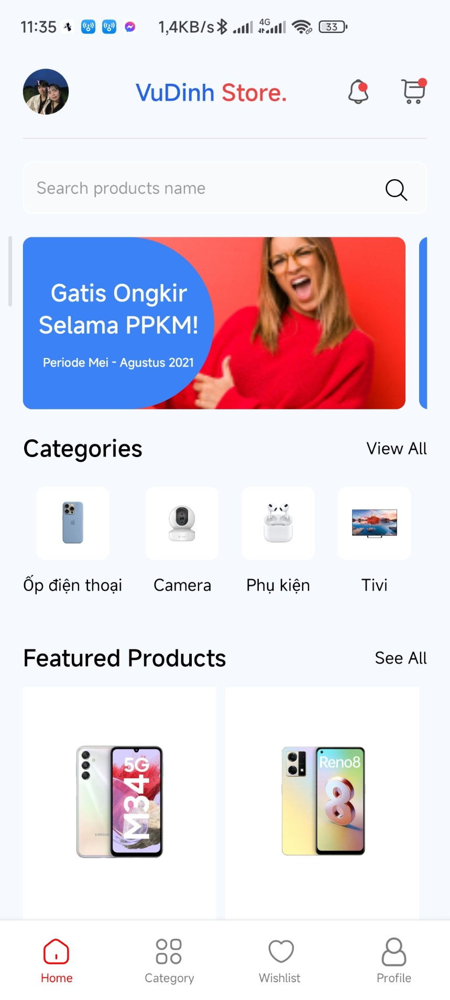
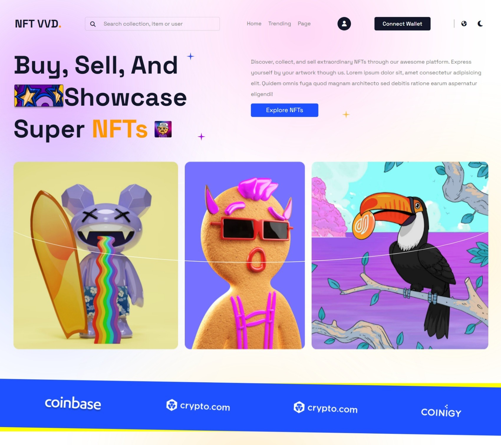

<!-- PROJECT LOGO -->
 

  

  <h1 align="center"> Vu Van Dinh</h1>

  

   Fullstack developer
     
    <a href="https://vuvandinh.id.vn/"><strong>My Home Page »</strong></a>
     
     
    <a href="">ReactJS</a>
    ·
    <a href="">NodeJS</a>
    ·
    <a href="">ExpressJS</a>
    ·
    <a href="">PHP</a>
    ·
    <a href="">Laravel</a>
  

##  About Me

Hi, I'm Vu Dinh, Full-stack,Ho Chi Minh city.

I am passionate about end-to-end development to create user-friendly websites. With 1 year of experience working with HTML/CSS, JavaScript, ReactJS, ExpressJS and Laravel. I have developed strong capabilities in these technologies. I pride myself on my ability to quickly learn new skills, work effectively in teams, and communicate well.

You can visit my little corner at <https://vuvandinh.id.vn/>

****

<a href="https://github.com/vuvandinh123">
    <picture>
        <source media="(prefers-color-scheme: dark)" srcset="https://github-readme-activity-graph.vercel.app/graph?username=vuvandinh123&theme=github-dark&area=true&hide_border=true&custom_title=Past%20Months%20Activity&color=ffffff&bg_color=0e1116">
        
    </picture>
</a>

(<a href="#top">Back to top</a>)

## My Projects

### Ecommerce website buy Laptop, Smartphone, Smartwatch...

  

### App ecommerce use React Native

  

### Website NFT Marketplace

  

### 📈 my github stats

    

